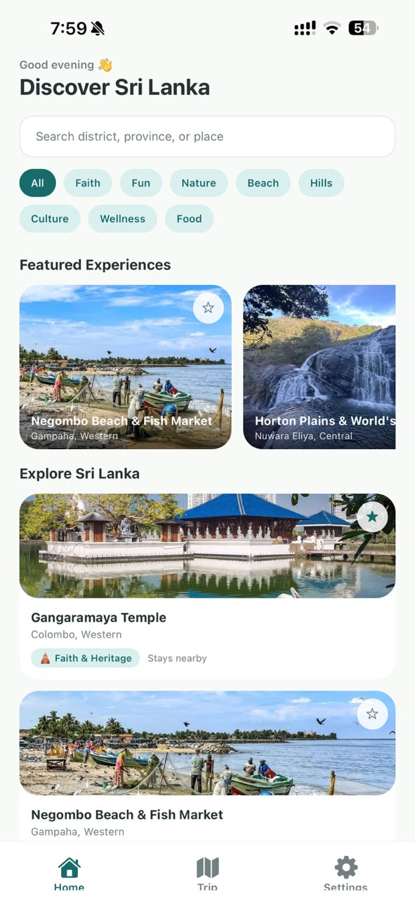
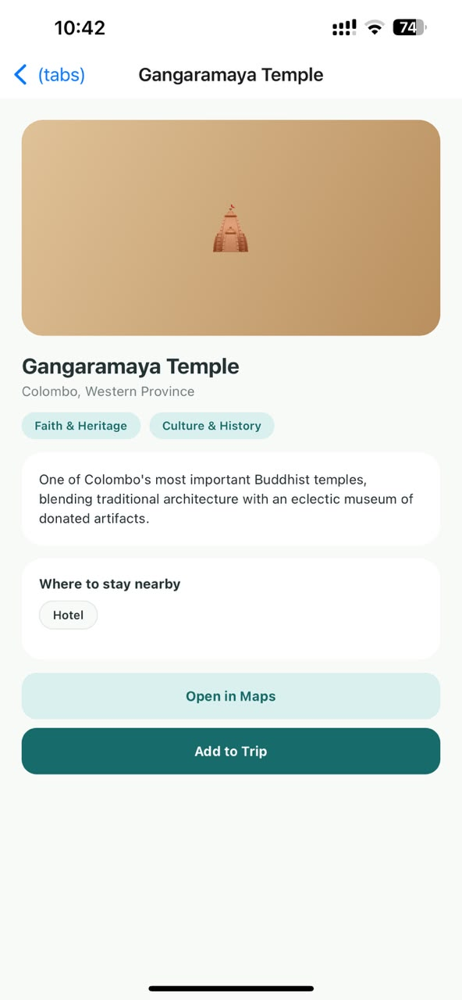
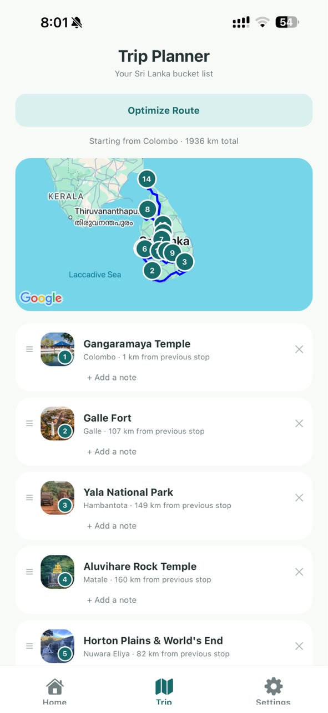
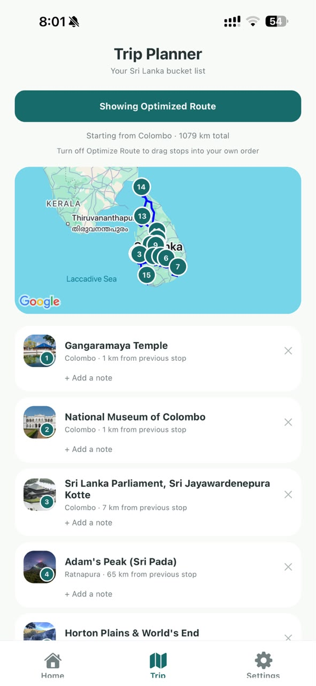
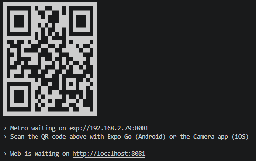

# Ceylora — Sri Lanka Travel Planner

## Target Domain
Travel & Tourism — specifically domestic and inbound travel within Sri Lanka.

## Problem Statement
Travellers exploring Sri Lanka face a scattered set of resources — blogs, generic
map apps, and word of mouth — to figure out what's actually worth visiting in a
given district, whether it matches what they're after (temples, adventure,
beaches, hiking, wildlife, and more), and in what order to visit everything on
their list without doubling back across the country.

Ceylora gives travellers a single, curated directory of 54 Sri Lankan
destinations that can be searched by district or province, filtered by
interest, and assembled into a day-by-day trip with a one-tap route optimizer.

## Features

### Splash Screen
An animated launch screen (`components/app-splash.tsx`) shows the Ceylora logo
and a loading bar for ~1.2s before handing off to the main app.

### Home — Discover
- Time-of-day greeting ("Good morning/afternoon/evening") and a search bar
  that matches destination name, district, or province as you type.
- Category filter chips for all 8 interest types: Faith & Heritage, Fun &
  Adventure, Nature & Wildlife, Beaches, Hill Country, Culture & History,
  Wellness, and Food & Markets.
- A horizontally-scrolling **Featured Experiences** rail (destinations tagged
  with a `bestFor` highlight, e.g. "Sunrise hike", "Whale watching Nov–Apr"),
  shown when no search or filter is active.
- An **Explore Sri Lanka** list below — the full 54-destination set, each
  card showing a real photo, name, district/province, primary category tag,
  and whether nearby stays exist. Searching or picking a category filters
  this same list down to the matching results.
- Tap the ☆ / ★ star on any card to bookmark it straight to your trip without
  opening the detail screen.

### Destination Detail
Tap any destination to see:
- A full-width photo hero banner for the destination.
- Full name, district/province, and all category tags for that place.
- A "Best for" highlight banner when the destination has one (peak season,
  best time of day, etc.).
- Full description and, if available, nearby stay-type tags (Hotel, Resort,
  Villa, Guesthouse, Eco-lodge).
- An embedded **Location** map pinned to the destination's coordinates,
  right on the page — no need to leave the app to see where it is.
- **Open in Maps** — deep-links to the destination's coordinates in the
  device's default maps app for full turn-by-turn directions.
- **Add to Trip / Remove from Trip** — toggles the destination in your trip
  bucket list.

### Trip Planner
- Shows every destination you've bookmarked, each with its photo thumbnail
  and order badge. Backed by a MockAPI REST resource with local storage as
  the source of truth, so your trip persists across app restarts, survives
  offline use, and never silently loses a change if the API request for it
  fails.
- Reorder stops by dragging them — press and hold the **☰** handle and drag
  a stop up or down, like reordering waypoints on Google Maps. Your custom
  order is what "add-order" means everywhere else on the screen (map,
  distances, badges).
- An embedded overview map above the list, numbered-pin per stop (matching
  the list below) with a line tracing the *currently shown* order — your
  manual order, or the optimized route once toggled — snapped to actual
  roads (via a free OSRM routing lookup) rather than a straight line, auto-
  framed to fit every stop. Falls back to a straight line between stops if
  the routing request fails or hasn't resolved yet.
- **Optimize Route** — reorders your stops using a nearest-neighbour
  heuristic (Haversine great-circle distance) starting from Colombo, a
  simple, explainable approximation of the travelling-salesman problem that
  avoids doubling back across the island. Tap again to switch back to your
  manual order (the ☰ drag handle is hidden while an optimized route is
  showing, since reordering only applies to your own order).
- Shows the distance (km) from the previous stop for each leg, and the trip's
  total distance from Colombo.
- Flags when your added order is already the shortest possible route.
- Tap a stop's note line to add or edit a personal note for that stop
  (e.g. "visit at sunrise") — saved to the API and cached locally.
- Remove any stop from the list with the ✕ button.
- A loading indicator appears while the trip list is first fetched; a
  dismissable error banner with a **Retry** button appears if the API is
  unreachable, and the app keeps working from the last locally saved trip.
- Empty state prompts you to add destinations from Home.

### Settings
- **Dark Mode** toggle — switches the whole app between light and dark color
  palettes instantly.
- **About Ceylora** card with a short description and version number.

## Screens
1. **Home** ([app/(tabs)/index.tsx](<app/(tabs)/index.tsx>)) — destination list, search, category filter, featured rail.
2. **Destination Detail** ([app/destination/[id].tsx](<app/destination/[id].tsx>)) — full details, map link, add/remove trip.
3. **Trip Planner** ([app/(tabs)/trip.tsx](<app/(tabs)/trip.tsx>)) — bucket list + route optimizer.
4. **Settings** ([app/(tabs)/settings.tsx](<app/(tabs)/settings.tsx>)) — dark mode, about.

## State & Architecture
- `useState` for search text and selected category (Home), and the
  optimize/added-order toggle (Trip).
- **React Context** ([context/trip.tsx](context/trip.tsx)) owns the trip list's state machine
  (`tripItems`, `loading`, `error`) and shares it across Home, Detail, and
  Trip screens without prop drilling. It fires off the initial cache load +
  API sync, and exposes `addToTrip` / `removeFromTrip` / `updateNote` /
  `reorderTrip` — all local-first (see **REST API Integration & Local
  Persistence** below), with every record from the cache or the server
  validated (`isValidTripItem` in [lib/api.ts](lib/api.ts)) before it's trusted, so a
  malformed record from a misconfigured API resource can't crash the app.
- **React Context** ([context/theme.tsx](context/theme.tsx)) shares the light/dark theme and a
  small design-token system (`spacing`, `radius`) the same way, driven by the
  toggle in Settings.
- [lib/route.ts](lib/route.ts) holds the pure route-optimization logic (Haversine distance +
  greedy nearest-neighbour ordering) — no external API required.
- [lib/api.ts](lib/api.ts) is a small typed REST client (`fetch` + `AbortController` timeout)
  for the MockAPI `tripitems` resource — `fetchTripItems`, `createTripItem`,
  `updateTripItem`, `deleteTripItem`.
- [lib/storage.ts](lib/storage.ts) wraps AsyncStorage to cache the trip list locally, so the
  Trip Planner renders instantly on launch and still works offline.
- [lib/config.ts](lib/config.ts) holds the MockAPI base URL — see **REST API Setup** below.
- [lib/directions.ts](lib/directions.ts) fetches a road-snapped route from OSRM for the Trip
  Planner map — see **Embedded Maps** below.
- [data/destinations.ts](data/destinations.ts) holds the 54-destination dataset plus category and
  stay-type display metadata (labels/icons) used across the app.
  [data/destination-photos.ts](data/destination-photos.ts) maps each destination id to its photo in
  [assets/locationphotos](assets/locationphotos) — see **Design Note** below.
- Reusable UI components: [components/destination-card.tsx](components/destination-card.tsx) (list/featured
  cards), [components/destination-map.tsx](components/destination-map.tsx) / [trip-map.tsx](components/trip-map.tsx) (embedded maps —
  see **Embedded Maps** below), [components/ui/button.tsx](components/ui/button.tsx) (primary/secondary/tertiary
  button), and [components/app-splash.tsx](components/app-splash.tsx) (launch screen). The Trip Planner's
  drag-to-reorder list uses [react-native-draggable-flatlist](https://github.com/computerjazz/react-native-draggable-flatlist).

## REST API Integration & Local Persistence

The Trip Planner's bucket list is backed by a [MockAPI](https://mockapi.io)
REST resource called `tripitems`, instead of living only in memory:

| Operation | Method | Used by |
|---|---|---|
| List the trip | `GET /tripitems` | Loading the Trip Planner |
| Add a stop | `POST /tripitems` | ☆ on Home / "Add to Trip" on Detail |
| Edit a note or reorder | `PUT /tripitems/:id` | Editing a note / dragging a stop in Trip Planner |
| Remove a stop | `DELETE /tripitems/:id` | ✕ on Trip Planner / "Remove from Trip" |

Each `tripitems` record stores `destinationId` (a foreign key back into the
local `destinations.ts` dataset), `name`, `district`, `notes`, `order` (the
user's custom position in the list), and `addedAt` — the destination's full
detail (description, coordinates, etc.) is never duplicated into the API,
only the fields needed to render the trip list.

**Local storage is the source of truth, not just a cache.** On launch, the
cached trip list loads from `AsyncStorage` immediately so the UI is never
blank, then a background `GET` reconciles with the server. Every mutation
(`add`/`remove`/`updateNote`/`reorderTrip`) applies to state and
`AsyncStorage` immediately and **stays applied even if the matching API
request fails** — a flaky connection shows an error banner (with **Retry**)
but never discards a stop you added, removed, reordered, or annotated.
A background refresh merges in server changes on top of that local state
rather than overwriting it: any not-yet-synced local addition is kept
(and de-duplicated once the server confirms it), and a local removal that
hasn't reached the server yet is kept hidden — via `lib/storage.ts`'s
`pendingDeleteIds` — instead of reappearing on the next sync.

**Loading / empty / error states:** a spinner shows on first load, a
"Syncing…" label shows during a background refresh once data is already on
screen, the existing empty state covers zero trip items, and a dismissable
banner with a **Retry** button covers request failures without blocking the
rest of the screen.

## Embedded Maps

Both the Destination Detail and Trip Planner screens embed a real map
in-page (via [react-native-maps](https://github.com/react-native-maps/react-native-maps))
instead of only linking out to an external Maps app:

- [components/destination-map.tsx](components/destination-map.tsx) — a single pinned marker at the
  destination's coordinates. Pan/zoom are disabled (it's a preview, not a
  navigable map) so it doesn't fight the screen's scroll gesture; tapping it
  still opens full directions in the device's Maps app.
- [components/trip-map.tsx](components/trip-map.tsx) — one numbered pin per trip stop (matching the
  order shown in the list below it) plus a polyline tracing the current
  route order, auto-fitted to frame every stop via `fitToCoordinates`. The
  line is fetched from [OSRM](http://project-osrm.org/)'s free public routing
  API ([lib/directions.ts](lib/directions.ts)) so it follows actual roads instead of cutting
  straight lines through the countryside; it falls back to a straight line
  between stops if that request fails or is still in flight. Requested at
  `overview=simplified` and capped at 300 points — a full-detail route
  through several stops can be thousands of points per leg, which is a
  known crash/ANR risk for `react-native-maps`' `Polyline` on Android.

`react-native-maps` has no web renderer, so `destination-map.web.tsx` and
`trip-map.web.tsx` (Metro picks the `.web.tsx` file automatically on that
platform, the same convention already used by [components/ui/icon-symbol.tsx](components/ui/icon-symbol.tsx))
fall back to a static preview image from a free, no-API-key tile service
instead — the app never crashes or shows a blank map on web, just a lower-
fidelity preview.

Both map components force `provider={PROVIDER_GOOGLE}`, so the app shows
Google Maps everywhere (not Apple Maps on iOS, which is `react-native-maps`'
default there).

**Note on Google Maps API keys:** on Android, Expo Go serves a shared
development key, so no setup is needed until a production build. An
EAS-built standalone APK needs its own key — add
`android.config.googleMaps.apiKey` in `app.json` with a key from the
[Google Cloud Console](https://console.cloud.google.com/google/maps-apis)
before building for submission; without it, the map still renders but shows
a "for development purposes only" watermark.

iOS is different: Google Maps has **no built-in fallback key**, and Expo Go
cannot inject a custom one, so `PROVIDER_GOOGLE` renders a **blank grey map**
on iOS in Expo Go regardless of setup. To see the map on iOS you need a
custom dev client — add
```json
"ios": { "config": { "googleMapsApiKey": "YOUR_IOS_KEY" } }
```
to `app.json` with a key from the Google Cloud Console, then build with
`npx expo run:ios` or an EAS dev-client build (`expo prebuild` regenerates
the native `ios/` project, which is gitignored here). This doesn't affect
Android or the web fallback — only iOS testing.

### REST API Setup
This repo is already wired to a live MockAPI project. To point it at your
own instead:
1. Create a free project at [mockapi.io](https://mockapi.io).
2. Add a resource named `tripitems` with fields `destinationId`, `name`,
   `district`, `notes`, `addedAt` (strings), and `order` (number) — set
   `destinationId` to type **String**, not the default "Object ID" type
   (that's for relations to other resources, not a plain id string).
3. Copy the "API endpoint" base URL shown on the project dashboard
   (`https://<projectId>.mockapi.io` — no `/api/v1` suffix on newer MockAPI
   projects) into `MOCKAPI_BASE_URL` in [lib/config.ts](lib/config.ts).

## Design Note
Destination coordinates power both the embedded preview maps (see
**Embedded Maps** above) and an "Open in Maps" deep link for full
turn-by-turn directions in the device's Maps app.

Every destination has a real photo from [assets/locationphotos](assets/locationphotos),
mapped to each destination by id in [data/destination-photos.ts](data/destination-photos.ts)
(Metro requires each asset path as a string literal, so the 54 photos are
`require()`'d by hand there rather than built from a filename pattern). It's
used as the Destination Detail hero banner, on every destination card
(Home's Featured rail and Explore list), and as the thumbnail on each Trip
Planner stop.

## Setup Instructions
1. Install dependencies:
   ```bash
   npm install
   ```
2. Configure your own MockAPI resource — see **REST API Setup** above
   (the app runs with a placeholder URL otherwise, and the Trip Planner
   will show a connection error with cached/offline data only).
3. Start the app:
   ```bash
   npx expo start
   ```
   Platform-specific shortcuts are also available:
   ```bash
   npm run android   # open directly in an Android emulator/device
   npm run ios       # open directly in an iOS simulator/device
   npm run web       # run in a browser
   ```
4. Scan the QR code with Expo Go on Android/iOS, or press `a` / `i` / `w` in
   the terminal to launch an emulator/simulator/browser.
5. `npm run lint` runs ESLint over the project.

## Screenshots

| Home | Destination Detail |
|---|---|
|  |  |

| Trip Planner (added order) | Trip Planner (optimized route) |
|---|---|
|  |  |

Scan to run the app with Expo Go:


